# 🤝 Volunteer Management System

A full-stack web application built with **Flask** and **MySQL** to manage volunteer programs, track participation, and support community activities.

---

## 📸 Screenshots

### 🔐 Login Page

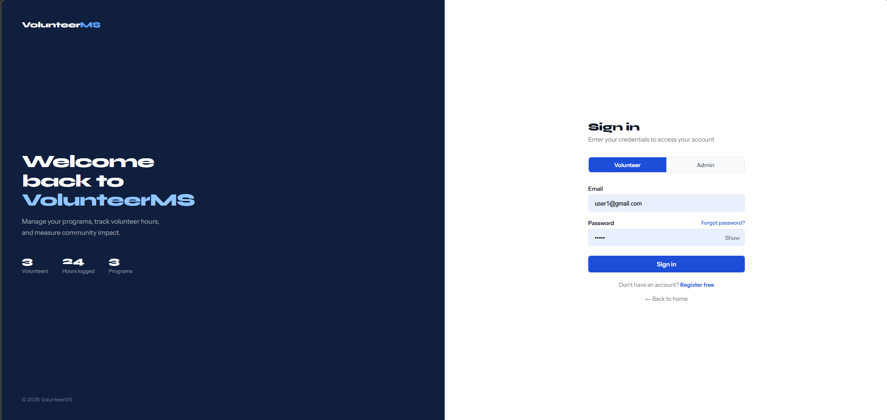

### 📝 Registration Page

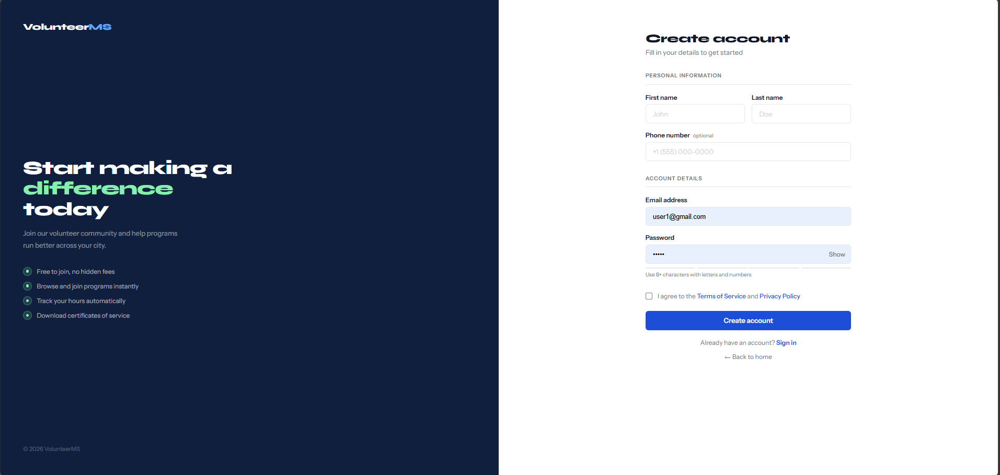

### 🧑‍💼 Admin Dashboard

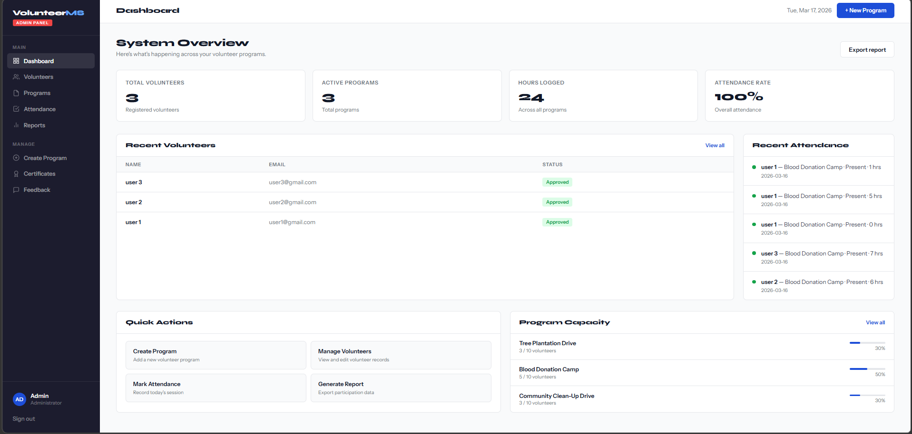

### 🙋 Volunteer Dashboard

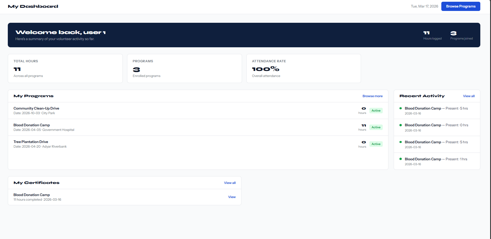

### 📋 Programs

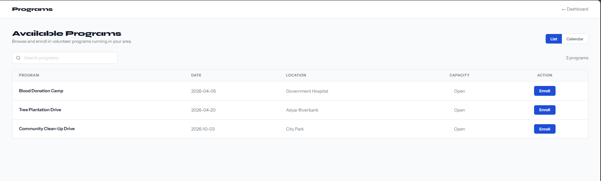

### ➕ Create Program

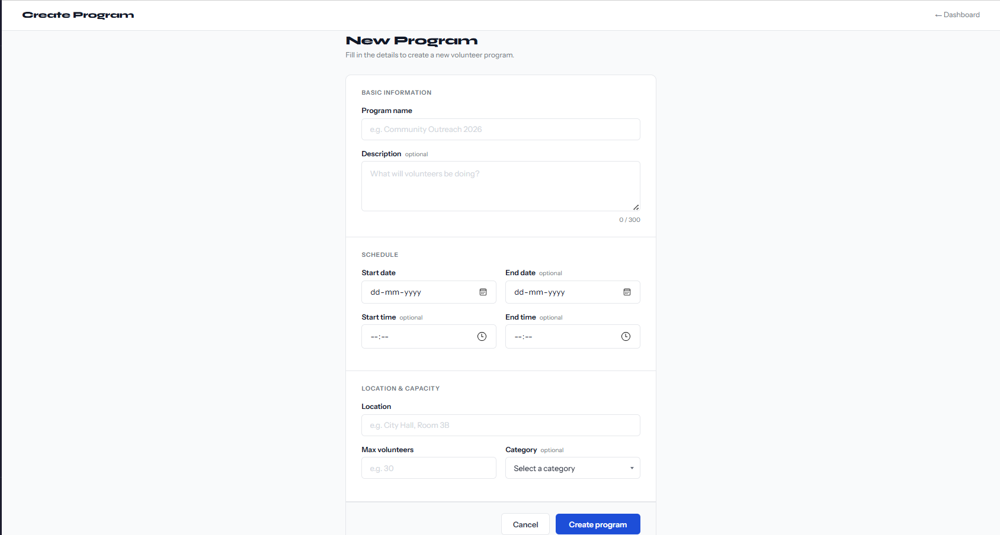

### 📅 Attendance Tracking

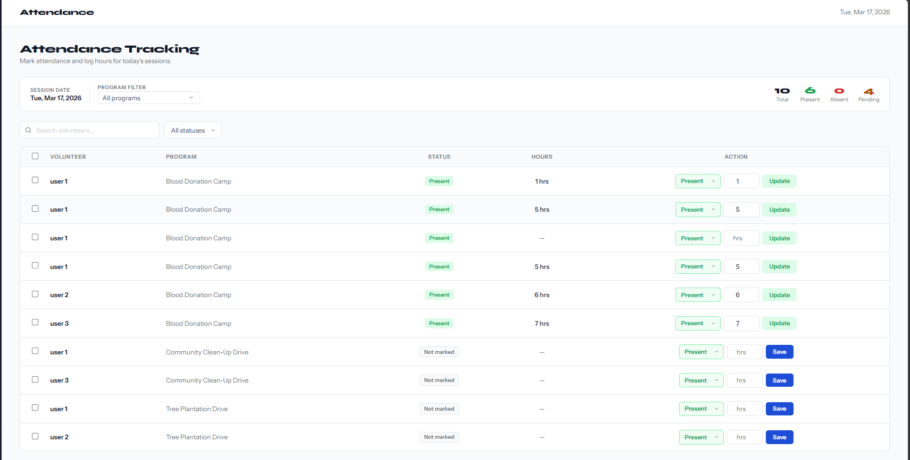

### 📊 Reports

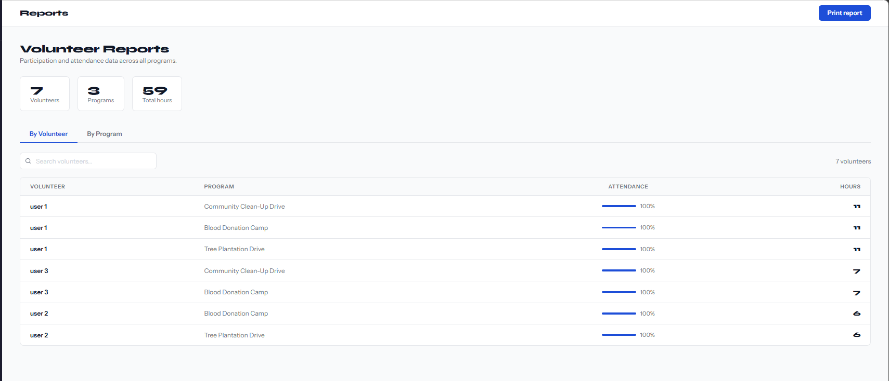

### 🖨️ Report Print

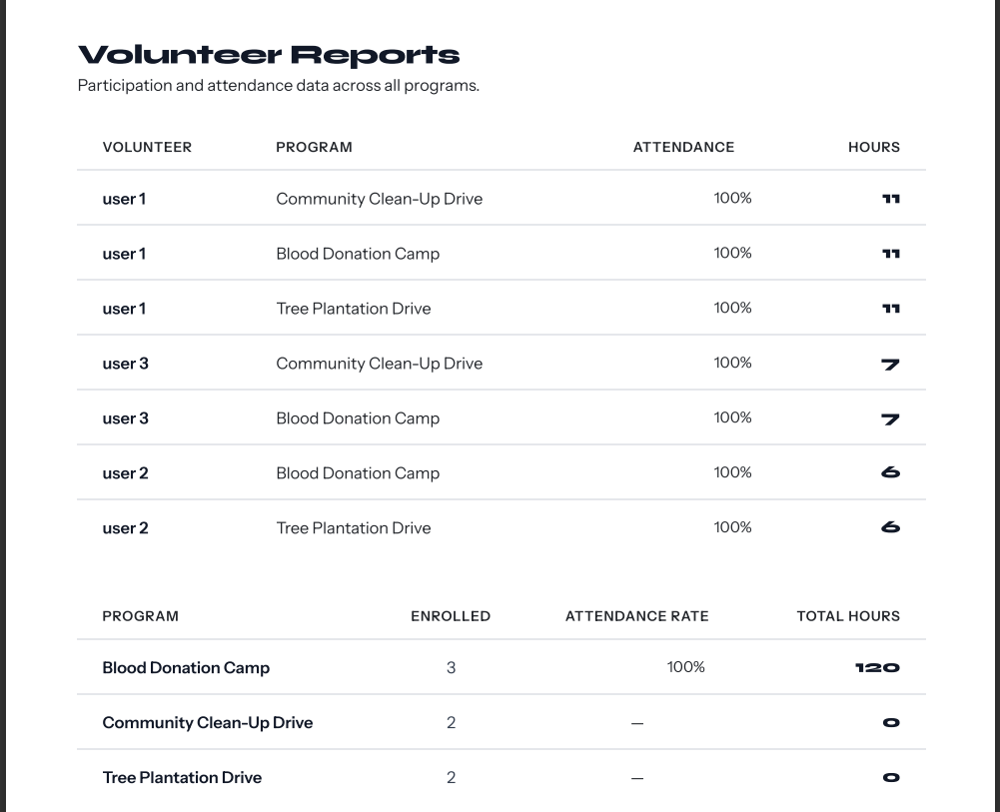

### 🏅 Certificate

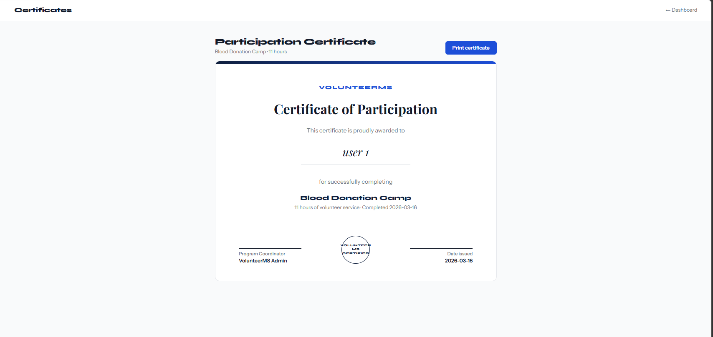

### 💬 Feedback

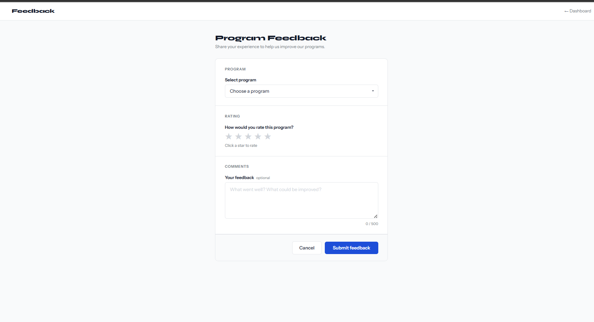

---

## 🚀 Features

| Feature | Description |
|---|---|
| 👤 Volunteer Registration | Volunteers can register and await admin approval |
| 🔐 Role-Based Login | Separate login for Admin and Volunteer |
| ✅ Admin Approval | Admin can approve or reject volunteer registrations |
| 📋 Program Management | Admin can create and manage volunteer programs |
| 📝 Program Enrollment | Volunteers can browse and enroll in programs |
| ✔️ Attendance Tracking | Admin marks attendance and logs hours per session |
| 📊 Dashboard Analytics | Real-time stats for both admin and volunteer |
| 📜 Activity History | Volunteers can view their full participation history |
| 🏆 Certificates | Volunteers can view and print participation certificates |
| 💬 Feedback Collection | Volunteers can submit ratings and feedback for programs |
| 📈 Reports | Admin can generate and print participation reports |
| 📅 Program Calendar | Visual calendar view of all scheduled programs |

---

## 🛠️ Tech Stack

- **Frontend** — HTML, CSS, JavaScript
- **Backend** — Python (Flask)
- **Database** — MySQL
- **Fonts** — Syne, Instrument Sans (Google Fonts)

---

## 📁 Project Structure

```
volunteer_system/
├── templates/
│   ├── index.html
│   ├── login.html
│   ├── register.html
│   ├── admin_dashboard.html
│   ├── volunteer_dashboard.html
│   ├── manage_volunteers.html
│   ├── programs.html
│   ├── attendance.html
│   ├── activity_history.html
│   ├── reports.html
│   ├── certificates.html
│   ├── feedback.html
│   └── create_program.html
├── app.py
├── database.sql
├── requirements.txt
└── README.md
```

---

## ⚙️ Setup Instructions

### 1. Clone the repository
```bash
git clone https://github.com/VaishnaviSuresh57/volunteer_system.git
cd volunteer_system
```

### 2. Install dependencies
```bash
pip install -r requirements.txt
```

### 3. Setup MySQL database
- Open MySQL and run:
```sql
CREATE DATABASE volunteer_system;
USE volunteer_system;
```
- Then run all the queries from `database.sql`

### 4. Configure database in app.py
```python
db = mysql.connector.connect(
    host="localhost",
    user="root",
    password="your_password",
    database="volunteer_system"
)
```

### 5. Run the application
```bash
python app.py
```

### 6. Open in browser
```
http://localhost:5000
```

---

## 👤 Default Admin Login

| Field | Value |
|---|---|
| Email | admin@gmail.com |
| Password | admin123 |
| Role | Admin |

---

## 🗄️ Database Tables

| Table | Purpose |
|---|---|
| `admins` | Admin login credentials |
| `volunteers` | Volunteer registrations |
| `programs` | Volunteer programs |
| `enrollments` | Program enrollments |
| `attendance` | Session attendance records |
| `feedback` | Volunteer feedback and ratings |

---

## 👩‍💻 Developed By

**Vaishnavi S**  
Volunteer Management System — 2026
